# So sánh công cụ vẽ sơ đồ: Graphviz vs D2 vs Mermaid

Cùng **một** sơ đồ (toàn cảnh hệ thống AMC) được dựng lại bằng cả 3 công cụ để so
sánh thực tế — không chỉ đọc đánh giá lý thuyết mà thấy tận mắt.

## Kết quả hình: cả 3 đều thể hiện nội dung tốt như nhau

- ✅ Tiếng Việt đầy đủ dấu ở cả 3.
- ✅ Công thức `η = R_code × log₂(M) × (1 − BLER)` + `≤ × →` hiện đúng ở cả 3
  (đều dùng glyph Unicode, **không** cần math engine).
- ✅ Cluster / subgraph OFFLINE / ONLINE ở cả 3.

→ Về khả năng **vẽ ra hình**, không bên nào thắng rõ. Khác biệt nằm ở chỗ khác
(cài đặt, cú pháp, xuất file, phụ thuộc).

### Graphviz (đang dùng)


### D2


### Mermaid


## So sánh thật (cùng 1 sơ đồ, tự dựng cả 3)

| Tiêu chí | **Graphviz** (đang dùng) | **D2** | **Mermaid** |
|---|---|---|---|
| Cài / offline | 1 bước winget | 1 binary + playwright 1.3MB | **5 bước**: Node → mermaid-cli → tải Chrome → dọn tải lại → tự viết config trỏ `chrome.exe` |
| Cú pháp | HTML-like dài, có bẫy escape (đã bọc helper) | **Gọn nhất** (markdown trong khối), dễ đọc/sửa | Gọn, nhưng nhãn đặc biệt phải quote, `&` phải đổi |
| Layout | Chặt, kiểm soát tốt (sau khi chỉnh) | Auto, hiện đại nhưng **sprawl** hơn | Auto, **tự wrap text** → node cao/boxy |
| Xuất | **SVG + PDF vector gốc** | SVG vector; PDF bị raster | SVG; PDF qua Chromium |
| Phụ thuộc | `dot` (gọn) | 1 binary Go | **Node + Chromium ~vài trăm MB** |

> Riêng Mermaid: render được nhưng phải tự viết `puppeteer-config.json` trỏ thẳng
> `chrome.exe` mới chịu chạy (puppeteer không tự tìm ra Chrome dù đã tải đúng phiên
> bản) — đúng "cực hình offline" mà đánh giá đã cảnh báo.

## Kết luận (sau khi thấy tận mắt)

- **Mermaid**: render được nhưng offline cực phiền — chỉ hợp viết nhanh trên
  GitHub/web (render online), không nên làm pipeline offline.
- **D2**: cú pháp đẹp nhất, đủ nhẹ, tiếng Việt + công thức OK — **ứng viên thay thế
  hợp lý nếu làm lại từ đầu**.
- **Graphviz**: vẫn **tối ưu** cho đồ án này vì toolkit đã chạy ngon, nhẹ, và
  **PDF vector trực tiếp** (quan trọng cho LaTeX).

**Khuyến nghị:** giữ **Graphviz** làm chính; nếu mê cú pháp D2 thì D2 là phương án 2 ổn.

## Cách dựng lại 3 bản

```bash
# Graphviz (toolkit chính)
cd ..  &&  python draw_system_diagram.py amc_system_overview

# D2  (cài: winget install Terrastruct.D2)
d2 amc.d2 amc_d2.svg

# Mermaid (cài: Node + npm i -g @mermaid-js/mermaid-cli + tải Chrome cho puppeteer)
#   cần puppeteer-config.json trỏ chrome.exe theo MÁY hiện tại (sửa path nếu máy khác):
#   { "executablePath": "C:\\...\\chrome.exe", "args": ["--no-sandbox"] }
mmdc -i amc.mmd -o amc_mermaid.svg -b white -p puppeteer-config.json
```
